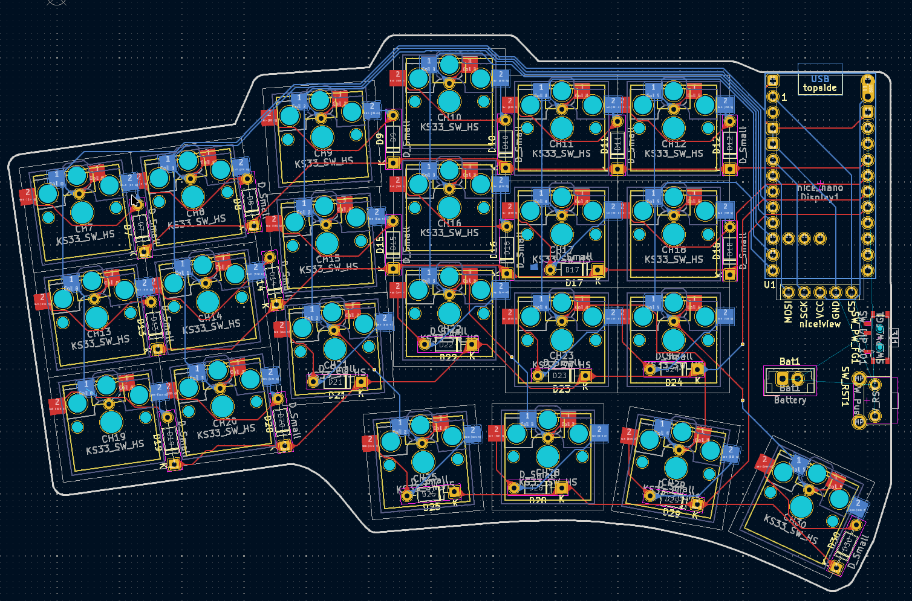
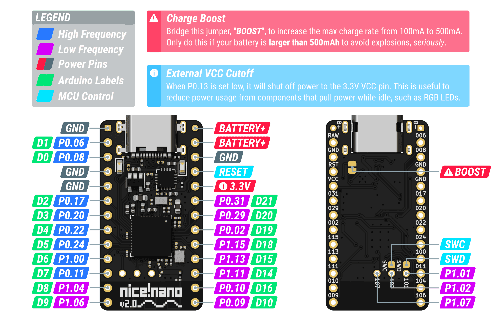
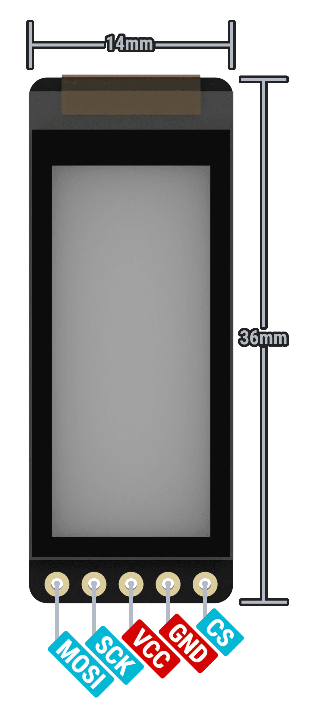

# Sighol-44

# Installation

Remember to add the [marbastlib](https://github.com/ebastler/marbastlib) symbol and footprints library.
Check the github page for installation instructions.

# Documentation

[Nice nano pinout and schematic](https://nicekeyboards.com/docs/nice-nano/pinout-schematic)

## [Video about batteries](https://www.youtube.com/watch?v=zoCKINGh2DQ)

- GEt mill max sockets that are avtagbare.
- Get taller ones so that battery fit underneath.
- Solder on the power switch early on. He said "the first thing", but I am not sure if
  that matters a lot.

## Nice View

https://nicekeyboards.com/docs/nice-view/pinout-schematic#default-pins

- CS: D1/P0.06
- SCL: D2/P0.17
- MOSI: D3/P0.20

# Parts

- 2 x [Nice!Nano V2](https://42keebs.eu/shop/parts/controllers/nice-nano-v2-wireless-controller/)
- 2 x [Controller sockets/pins/headers medium](https://42keebs.eu/shop/parts/components/controller-sockets-pins-mill-max-generic/?attribute_pack=Medium+Profile+Sockets+%2B+Pins+%2825%29). Medium will fit 3mm batteries.
- 1 x [Nice!view](https://42keebs.eu/shop/parts/niceview-power-efficient-lcd-display/). I only need one for the left half.
- 2 x [SDM power switch](https://42keebs.eu/shop/parts/components/power-switch/?attribute_type=Micro+SMD+SPDT).
- 2 x [reset switch](https://42keebs.eu/shop/parts/components/reset-switch/).
- [Batteries](https://www.aliexpress.com/item/1005007625961666.html?spm=a2g0o.productlist.main.59.9ca11d420CydvJ&algo_pvid=120edaba-9165-4a9c-8ff5-5bade77d414c&algo_exp_id=120edaba-9165-4a9c-8ff5-5bade77d414c-29&pdp_ext_f=%7B%22order%22%3A%223%22%2C%22eval%22%3A%221%22%7D&pdp_npi=4%40dis%21NOK%2189.36%2178.63%21%21%2156.90%2150.07%21%40211b628117393867808432677e90e9%2112000041552681850%21sea%21NO%210%21ABX&curPageLogUid=lpMMqd58MoUq&utparam-url=scene%3Asearch%7Cquery_from%3A#nav-specification)

Total: 93.95 EUR on 42keebs.eu.

# TODO:

- Look for batteries and find one that fits.
